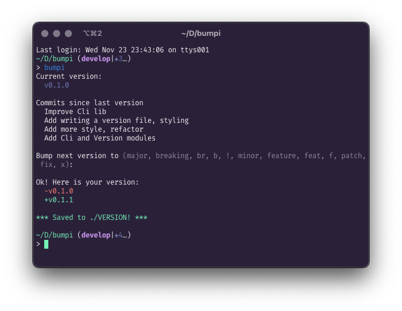

# Bumpi - a get next semantic version bump cli tool

Interactivly get the next version based on your latest git version tag and your last commits:



That's it!

# Usage

Binaries available soon!

```bash
# Install
cabal install

# Run
get-next-version
```

# Motivation

> Write programs that do one thing and do it well. [Unix philosophy](https://en.wikipedia.org/wiki/Unix_philosophy)

I tried conventional commits with a tool that generates the next version. I did not like conventional commits after all since they are for machines, not humans.

I wanted a tool that just bumps my version based on my git. But all of the tools out there are fully featured and highly specialized tools that do a bunch of stuff. For example:

  - [mroth/bump](https://github.com/mroth/bump) Can only be used with GitHub repos.
  - [sindresorhus/np](https://github.com/sindresorhus/np) For publishing NPM packages.
  - [thenativeweb/get-next-version](https://github.com/thenativeweb/get-next-version) Uses conventional commits.
  - [c4urself/bump2version](https://github.com/c4urself/bump2version) For Python.

So bumpi does just one thing and that's it. :)
